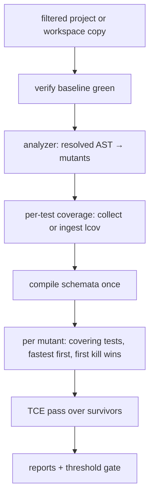

# Architecture decision records

Decisions distilled from the tool survey in [../research/](../research/index.md)
and mature tools in other ecosystems
([../research/other-ecosystems.md](../research/other-ecosystems.md)).

How the decisions compose at runtime:

| ADR | Title | Status |
|---|---|---|
| [0001](0001-implement-in-dart.md) | Implement in Dart | accepted |
| [0002](0002-parse-with-official-analyzer.md) | Parse with the official analyzer | accepted |
| [0003](0003-distribution-and-sdk-resolution.md) | Distribution and SDK resolution | accepted |
| [0004](0004-shadow-copy-isolation.md) | Shadow-copy isolation | accepted |
| [0005](0005-mandatory-baseline-verification.md) | Mandatory baseline verification | accepted |
| [0006](0006-outcome-taxonomy.md) | Outcome taxonomy | accepted |
| [0007](0007-deterministic-execution.md) | Deterministic execution | accepted |
| [0008](0008-composable-mutator-framework.md) | Composable mutator framework | accepted |
| [0009](0009-stryker-json-primary-report.md) | Stryker JSON as primary report | accepted |
| [0010](0010-mutant-schemata.md) | Mutant schemata | accepted, planned v1.0 |
| [0011](0011-per-test-coverage-routing.md) | Per-test coverage routing | accepted, planned v1.0 |
| [0012](0012-tce-equivalent-detection.md) | TCE equivalent-mutant detection | accepted, planned v2.0 |
| [0013](0013-score-and-honesty-metrics.md) | Score and honesty metrics | accepted |

Feature staging: [../roadmap/index.md](../roadmap/index.md).
