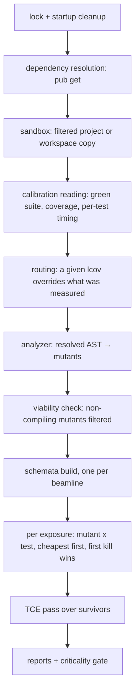

# Architecture decision records

Decisions distilled from the tool survey in [../research/](../research/index.md)
and mature tools in other ecosystems
([../research/other-ecosystems.md](../research/other-ecosystems.md)).

How the decisions compose at runtime:

| ADR | Title | Status |
|---|---|---|
| [0001](2026-08-14-implement-in-dart.md) | Implement in Dart | accepted |
| [0002](2026-08-14-parse-with-official-analyzer.md) | Parse with the official analyzer | accepted |
| [0003](2026-08-14-distribution-and-sdk-resolution.md) | Distribution and SDK resolution | accepted |
| [0004](2026-08-14-shadow-copy-isolation.md) | Sandbox isolation | accepted |
| [0005](2026-08-14-mandatory-baseline-verification.md) | Mandatory baseline verification | accepted |
| [0006](2026-08-14-outcome-taxonomy.md) | Outcome taxonomy | accepted |
| [0007](2026-08-14-deterministic-execution.md) | Deterministic execution | accepted |
| [0008](2026-08-14-composable-mutator-framework.md) | Composable mutator framework | accepted |
| [0009](2026-08-14-stryker-json-primary-report.md) | Stryker JSON as primary report | accepted |
| [0010](2026-08-14-mutant-schemata.md) | Mutant schemata | accepted, planned v1.0 |
| [0011](2026-08-14-per-test-coverage-routing.md) | Tracer coverage routing | accepted, staged v0.1-v1.0 |
| [0012](2026-08-14-tce-equivalent-detection.md) | TCE equivalent-mutant detection | accepted, planned v2.0 |
| [0013](2026-08-14-score-and-honesty-metrics.md) | Score and honesty metrics | accepted |
| [0014](2026-08-14-naming-and-vocabulary.md) | Naming and vocabulary | retired |
| [0015](2026-08-14-full-pana-score.md) | Full pana score | accepted |
| [0016](2026-08-15-wide-event-logging.md) | Wide-event logging | accepted |
| [0017](2026-08-15-parallel-classification.md) | Parallel classification | accepted |
| [0018](2026-08-15-run-workspace-lifecycle.md) | Run workspace lifecycle | accepted, staged v0.1–v0.2 |
| [0019](2026-08-16-static-viability-filtering.md) | Static viability filtering | accepted |
| [0020](2026-08-18-zero-setup-provisioning.md) | Zero-setup provisioning | accepted, staged v0.1-v0.2 |
| [0021](2026-08-21-beamline-execution.md) | Beamline execution | accepted, planned v1.0 |
| [0022](2026-08-21-process-interlock.md) | Process interlock | accepted |

Feature staging: [../roadmap/index.md](../roadmap/index.md).
