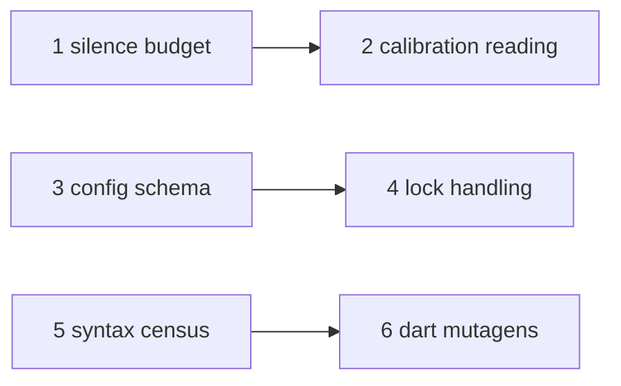

# v0.2 plan

- Status: pending

Six items for [../../roadmap/v0.2.md](../../roadmap/v0.2.md), one branch and
one document each. Every item records what it must leave behind for v1.0
([../../roadmap/v1.0.md](../../roadmap/v1.0.md)).

| # | Item | Shape | Needs |
|---|---|---|---|
| 1 | [silence-budget.md](silence-budget.md) | spike, then build | - |
| 2 | [calibration-reading.md](calibration-reading.md) | build | 1 |
| 3 | [config-schema.md](config-schema.md) | spike, then ADR | - |
| 4 | [lock-handling.md](lock-handling.md) | spike, then build | 3 |
| 5 | [syntax-census.md](syntax-census.md) | build | - |
| 6 | [dart-mutagens.md](dart-mutagens.md) | build | 5 |

## Order

The three chains are independent and can run in any order or at once.

| Edge | Why |
|---|---|
| 1 → 2 | [0020](../../decisions/0020-zero-setup-provisioning.md) rejected instrumenting the reading while half-lives were elapsed-time budgets. A silence budget is what unblocks it |
| 3 → 4 | `--non-interactive` is a name in a public schema; adding the flag first fixes it by accident |
| 5 → 6 | the census says which node kinds have no mutagen; choosing operators without it is guesswork |

## Not in v0.2

Beamline execution, schemata, per-test routing, and `--diff-base` stay in
v1.0. Items 1 and 2 exist to make them possible, not to start them.

## Per item

- One branch, merged before the next item on the same chain starts.
- User-visible items (2, 3, 4, 6) get a `## 0.2.0` CHANGELOG entry; 1 and 5
  are internal until they change a reported number.
- A spike is throwaway code answering the listed questions; only the recorded
  result is kept.
- An item that changes a decision updates its ADR in the same branch.
